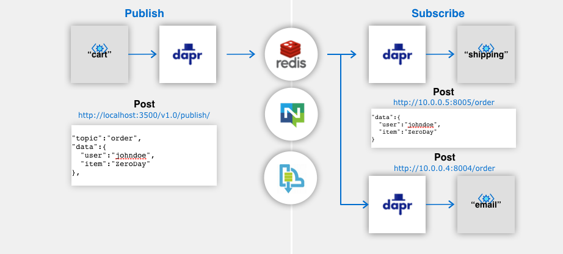
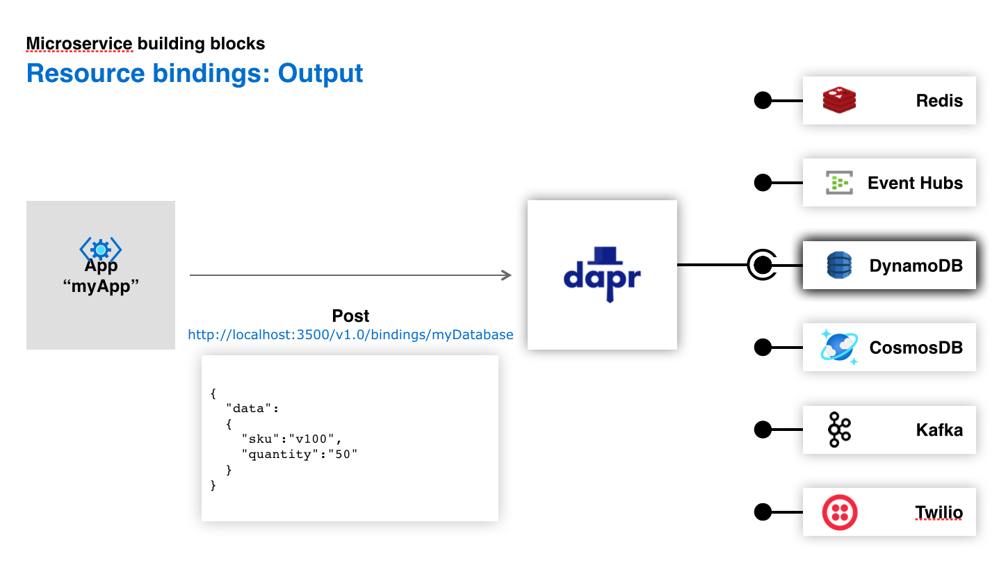
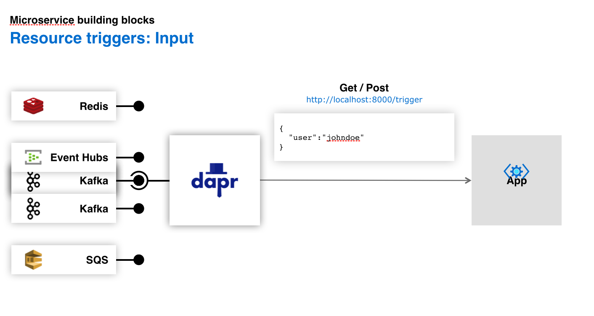

+++
author = "Shafin Siddique"
title = "Solving Problems in Microservice Based Applications with Dapr"
date = "2021-01-02"
description = "Introduction to Microservices, Publish Subscribe, Resource Binding, Service Invocation and Dapr."
tags = [
    "dapr",
    "microservices"
]
+++

A few years back, most applications were developed in monolithic style in which there's only three components :
 
1. A client side (or frontend) built out of HTML and Javascript.
 
2. A server side (or backend) that accepts HTTP requests from the client and executes business logic.
 
3. A database where information is stored.
 
The monolithic architectural style has a few drawbacks. Due to the entire business logic being in the server side, any small change requires developers to build and deploy the server side all over again. The application is also hard to scale as developers have to scale the entire application rather than the specific parts of the application that need greater resources.
 
### Enter Microservices
 
A microservice based application is built out of several loosely coupled services that can each be developed and deployed separately. These services communicate with each other through simple APIs.
 
For example, if you were to build an e-commerce application with the microservice architectural style, you would have the following services :
 
- Service A takes order requests from clients.
- Service B  validates whether a requested item is in the inventory.
- Service C validates payment.
- Service D accepts shipping requests and updates the database where shipping information is stored.
 
Microservices solve a lot of the problems that developers faced before. A change in one service does not require you to build and deploy all the other services, you can pick the best programming language for each service rather than having to build everything in one language, and you only have to scale the services that require scaling.
 
However, microservice based applications are not perfect. Like everything else in software development, there are tradeoffs. Building microservice based applications require tackling a brand new set of challenges. In this post, I talk about some of those challenges and how Dapr provides a unique solution to each.
 
### What is Dapr?
 
Distributed Application Runtime aka 'Dapr' is an open source tool developed by Microsoft that makes it easier for developers to build applications out of microservices. Dapr is extremely new but is quickly picking up traction and the community's great.
 
The way Dapr works is that it runs as a sidecar to your microservices. A sidecar service is one that does not execute main business logic but is deployed alongside another parent service that does. The sidecar goes wherever its parent does and its main purpose is to extend the functionality of the parent. It is important to note that the sidecar is a separate process and can be implemented in a different programming language than the parent, all that matters is that the two are deployed together and can communicate with one another.
 
 
We will see how deploying some of your microservices with a Dapr sidecar can help you tackle a lot of the challenges in microservice development.
 
### Service Invocation
 
In a monolithic application, invoking different components is a matter of function calls and class instantiation. In a microservice based application, you have different services that are deployed separately and they each have their own runtime. You can't call a function from Service A if the function is defined in Service B. If you want one service to communicate with another, you must do it using one of two ways : The synchronous way in which service A sends a HTTP request to Service B and waits for a response, or the asynchronous way in which service A publishes a message to a message broker that can be consumed by service B at a later time. In the asynchronous protocol, Service A does not wait for Service B to respond. We'll talk more about asynchronous communication between microservices and how Dapr makes it easier in the next section. In this section, we look into how Dapr makes the synchronous form of communication between services easier.
 
In the synchronous protocol, services send HTTP requests to other services and wait for a response. In order for Service A to send a request to Service B, service A needs to know the 'location' of service B. The location just means the IP Address of the machine where service B is deployed and the port that the service is deployed on that machine. Although this sounds simple, managing locations of different services is a huge hassle. Service A might need to communicate with services B, C, D, E and F. That means that service A has to keep track of the locations of 5 different services. If any of those locations change, service A needs to be updated so that it can continue to communicate with all the other services.
 
This is where Dapr comes in. If we deploy each of our microservices with its own Dapr sidecar, the Dapr sidecar of each service can take care of the entire service discovery process for us. Let me give you an example. Let's say we have 2 services : service A and service B. If service A wants to send a HTTP request to service B, it needs to know the location of service B. However, if we deploy each service with its own Dapr sidecar (sidecar A and sidecar B), all service A needs to do is let sidecar A know that it is trying to send this request to service B. Sidecar A takes the request, locates sidecar B (as sidecar B is the sidecar for service B), passes the request to sidecar B and waits for its response. Sidecar B then passes the request to service B and waits for the response. Once service B has processed the request, the response is sent back to sidecar B that transfers the response to sidecar A and finally, the response is delivered to service A.
 
This is a little hard to wrap your mind around at first read, so maybe this illustration will help.
 

 
We no longer have to embed the logic for determining the location of service B in service A. All service A needs to know is where it's sidecar is. This is not difficult at all since a parent and its sidecar is always deployed together and there is always a communication mechanism between the two. If the location of service B changes, we don't have to change anything in service A. The Dapr sidecar will take care of locating the sidecar of service B. Service A can also communicate with as many services as it wants to without having to maintain a list of locations. As long as the other services are deployed with a Dapr sidecar, sidecar A will successfully transfer the request to the correct sidecar and deliver the response back.
 
As we can see, Dapr provides a powerful abstraction for service discovery through its sidecars.
 
### Publish-Subscribe
 
Remember when we talked about how there's two protocols for communication between microservices? In the last section, we saw how Dapr makes synchronous communication between microservices easier. In this section, we look into how Dapr does the same for asynchronous communication.
 
There's different approaches we can use for asynchronous communication. One of these approaches is called Publish-Subscribe aka Pub/Sub. In pub/sub messaging, services that want to communicate with one another are either publishers or subscribers. Publishers send messages to topics, without any regard for who might be consuming those messages. Subscribers subscribe to topics and receive all messages that are published to that topic. Once a publisher sends a message, it does not wait for a response from any receiver. This is why it is called asynchronous communication. You might be wondering how publishers send messages to topics without knowing who the receivers are. Do they not have to know the locations? For pub-sub messaging to work, we use these tools called message brokers. A message broker is an intermediary tool that sits in your cluster and facilitates the communication between different services. The broker is essentially just another service in your application. It allows you to create topics and have different publishers publish to those topics as well as have subscribers subscribe to those topics. If service A wants to publish a message to the topic 'Orders', all it has to do is send a request to the broker and let it know that it is trying to send this message. From there on, the broker takes care of everything. Since it knows which services are subscribed to which topics, the broker delivers the message from Service A to all the services that are subscribed to the topic 'Orders'. Apache Kafka, RabbitMQ, and Redis are some examples of popular message brokers that you can use for your application.
 
When developing services that make the use of pub/sub messaging, one hurdle that developers face is having their services tied to a specific message broker. If the message broker that your application is using is Apache Kafka, in order to actually publish and receive messages, your services need to integrate the Kafka API. 
 
What you would normally do in this scenario is deploy a service that handles all communication with message brokers and exposes an API so that all the other services can make use of pub/sub messaging. This decouples all other services from any specific message broker since you can change your broker at any time without having to change the code in any of those services. All you have to change is the service handling communication with the broker. 
 
When you bring Dapr into the picture, you have the power to eliminate that additional service completely, meaning that Dapr enables you to integrate pub/sub messaging into your application without writing a single line of code that is coupled to a specific message broker. Here's how it works : You deploy your message broker with a Dapr sidecar. Dapr has support for almost every major message broker so the sidecar to your broker has the logic embedded in it to be able to communicate with most brokers you deploy it with. Any service in your application that wants to communicate with the broker simply needs to be deployed with its own sidecar and let the sidecar know (by sending a request) that it is trying to publish a message or subscribe to a topic. From there on, the dapr sidecar of the service takes care of everything. It is able to find the sidecar of the broker and pass the request. The sidecar to the broker then uses the API that your broker exposes to communicate with it. It even takes care of retries!
 
This is extremely powerful. Through the use of Dapr, we are able to decouple our entire application from any specific broker. We can change from Redis to Apache Kafka to RabbitMQ at any time and since Dapr has built-in support for all of them, the changes don't affect anything in our microservice based application. We also don't have to write a single line of code regarding communicating with message brokers.
 

 
### Bindings
 
The pub-sub example we saw in the previous section is an example of event-driven architecture. In event-driven architecture, events, defined as changes of state in one service such as receiving an order, are used to communicate between different services. It goes far beyond publish-subscribe.
 
Azure Functions and AWS Lambda are cloud services that allow you to run code without having to manage any servers yourself. You can trigger the code from any of your existing services simply by using the API that Functions and Lambda exposes. This action of using one service to trigger something in another is an example of event driven architecture and it goes hand in hand with microservice based applications. Another example is using the Twilio API to send a verification code whenever a new user registers to your site. It falls under the same idea of one service invoking an action in another due to an event. Note that your services can either trigger events or respond to events that were triggered by external systems. So not only can your services send texts using the Twilio API, they can also respond to texts.
 
A few issues come up for developers when working with event-driven architectures. You have to handle complexities such as connecting to, and polling from external systems. If you want your service to respond to texts, you need to write the code for polling from Twilio. Time is spent learning APIs of external systems and once you choose a particular system for a specific task, it is hard to change to another as code has to be rewritten.
 
Dapr provides an abstraction called 'bindings' that solves all of these problems and makes it extremely simple for developers to integrate event-driven architecture into their existing microservice based applications. Dapr bindings are essentially blocks that you can deploy and they take care of the logic of integrating external systems into your application so that you no longer have to write the code. If you wanted one of your services to send a text using Twilio, all you have to do now is deploy the Dapr Twilio binding and have your service run with a Dapr sidecar. Then, just like the previous two sections, our service lets its sidecar know by sending it a request that it is trying to send a text using Twilio. The sidecar looks for the Twilio binding and passes the request to it. Since the Twilio binding has Twilio specific logic embedded in it, it is able to successfully send our text.
 
Dapr has bindings support for not just Twilio but most major external systems that we use when building our applications. These include AWS S3, AWS Dynamodb, Azure Event Hubs, CosmosDB, Apache Kafka, and so much more. We can add as many bindings to our application as we want without having any of our services decoupled to any external system at all. We can also change from one binding to another without having to change anything more than the request body our services send to the Dapr sidecar that lets it know what binding we are trying to reach.

 
### Looking Ahead
 
If you've got to this point of the post, I hope you now have a better understanding on microservice based applications, some of the challenges developers face when building them, and the effectiveness of Dapr. Dapr solves a lot more problems such as state management, and tracing. Hopefully, I'll get to do a post on those too. The ideas are the same and now that you have a basic understanding, you can get started testing out some of the [sample applications](https://github.com/dapr/quickstarts) in the official Dapr documentation.
 
If you're interested in learning more about microservices or Dapr, here's some great resources that I personally found extremely helpful.

1. [The Official Dapr Documentation](https://github.com/dapr/docs)
2. [An Introduction To Microservices by Martin Fowler](https://martinfowler.com/articles/microservices.html)
3. [On Publish-Subscribe Messaging](https://aws.amazon.com/pub-sub-messaging/)
4. [Services in Kubernetes and how it does Service Discovery](https://kubernetes.io/docs/concepts/services-networking/service/)

